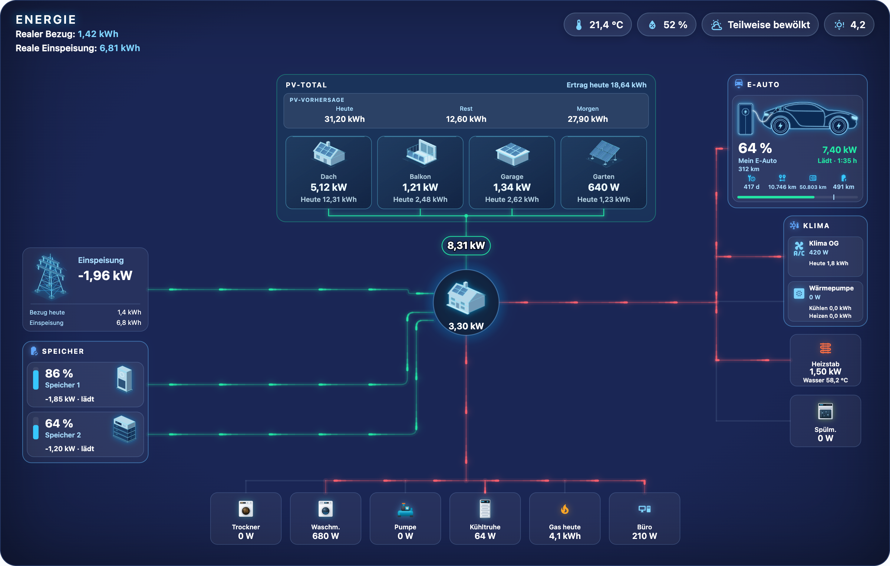
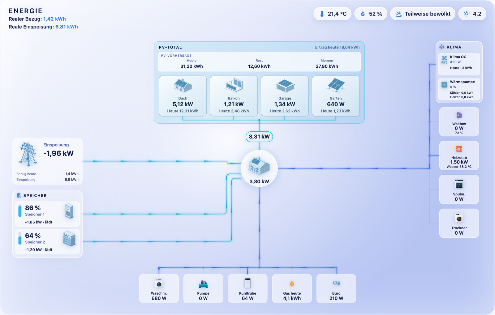
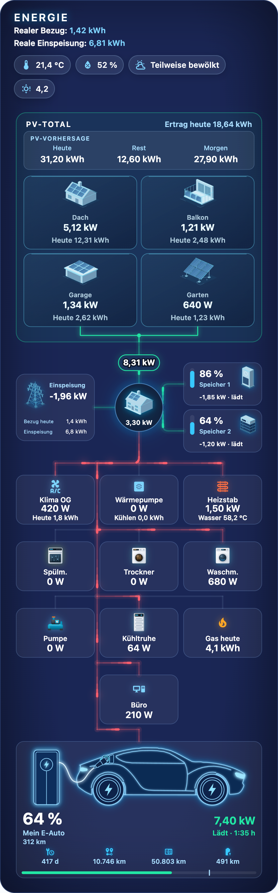
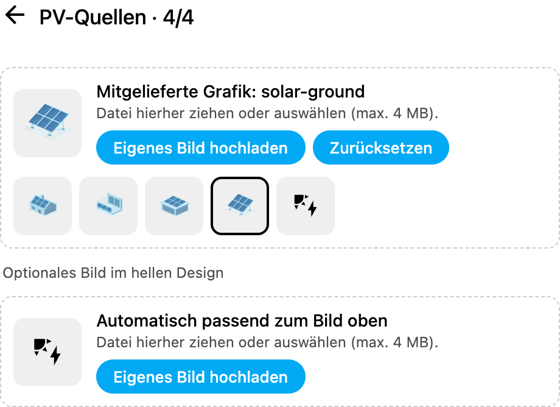
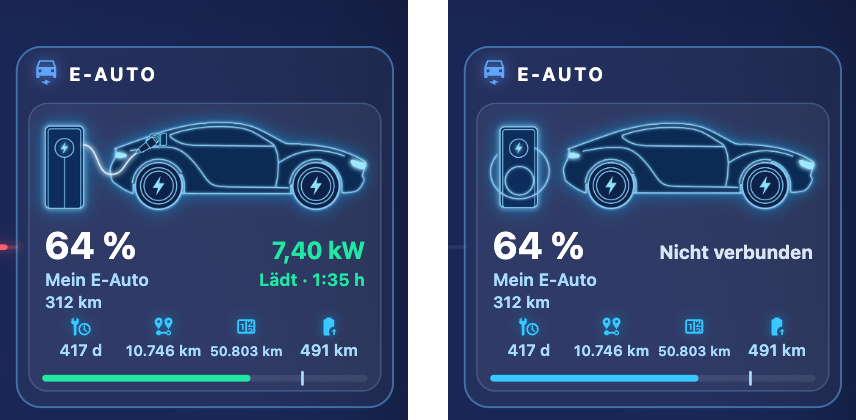
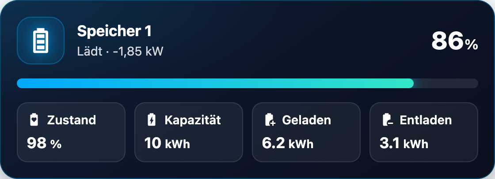

# Glass Energy Flow Card

**Deutsch** · [English](README.md)

[](https://hacs.xyz)
[](https://www.home-assistant.io)

Der komplette Energiefluss deines Hauses in **einer** animierten Karte im Glas-Look:
mehrere PV-Anlagen mit Tagesertrag und Prognose, Speicher, Netz, Haus, Klima und beliebig viele
Verbraucher und ein E-Auto – mit leuchtenden Stromflüssen, die Richtung und Leistung zeigen.



## Funktionen

- **PV-Total** mit beliebig vielen Anlagen (Leistung + Ertrag heute) und **PV-Prognose**
  (Heute / Rest / Morgen)
- **Speicher** – mehrere Batterien mit Ladestand (grün beim Laden, rot beim Entladen) und
  Lade-/Entladeleistung
- **Netz** mit Bezug/Einspeisung heute, **Haus** mit Gesamtverbrauch
- **E-Auto** – Ladestand und Ladeleistung auf einen Blick, Steckerstatus, Reichweite, Restzeit
  und bis zu sechs Zusatzwerte; gezeichnete Grafik oder eigenes Foto
- **Klima** – Klimaanlagen/Wärmepumpen mit eigenen Kennzahlen (z. B. Kühlen/Heizen heute)
- **Verbraucher** – frei konfigurierbar, mit Farbe, Bild und zweiter Zeile (z. B.
  Wassertemperatur am Heizstab)
- **Kopfzeile** mit realem Bezug/Einspeisung, Temperatur, Luftfeuchte, Wetter und UV-Index
- **Responsiv**: breites, mittleres und schmales Layout (Handy) automatisch
- **9 Farbschemata**, hell und dunkel, drei Leitungs-Animationen
- **Mitgelieferte Grafiken** für Haus, Netz, Speicher, PV, E-Auto und Haushaltsgeräte – direkt im Editor
  auswählbar, eigene Bilder per Upload
- **Bildschirm wachhalten** auf Echo Show und Fire-Tablets – kein Fotorahmen-Modus mehr
- **Deutsch und Englisch** – die Karte folgt automatisch der Sprache von Home Assistant
- **Visueller Editor** – alles per Klick, kein YAML nötig
- Dazu passend: die **Glass Energy Battery Card**

| Hell | Handy |
|---|---|
|  |  |

## Installation

### Über HACS (empfohlen)

[](https://my.home-assistant.io/redirect/hacs_repository/?owner=bh4it&repository=glass-energy-flow-card&category=plugin)

Oder von Hand:

1. In Home Assistant **HACS** öffnen.
2. Oben rechts **⋮ → Benutzerdefinierte Repositories**.
3. Repository: `https://github.com/bh4it/glass-energy-flow-card`, Typ: **Dashboard** → **Hinzufügen**.
4. Nach **Glass Energy Flow Card** suchen → **Herunterladen**.
5. Browser neu laden (bei Bedarf Cache leeren, in der App: *Einstellungen → Companion App →
   Frontend-Cache zurücksetzen*).

HACS legt die Ressource `/hacsfiles/glass-energy-flow-card/glass-energy-flow-card.js`
automatisch an.

### Manuell

1. Alle Dateien aus [`dist/`](dist) nach `<config>/www/glass-energy-flow-card/` kopieren.
2. **Einstellungen → Dashboards → ⋮ → Ressourcen → Ressource hinzufügen**:
   URL `/local/glass-energy-flow-card/glass-energy-flow-card.js`, Typ **JavaScript-Modul**.
3. Browser neu laden.

## Datenquellen

Die Karte bringt selbst keine Daten mit – sie zeigt Sensoren an, die du bereits in Home
Assistant hast. Diese Integrationen haben sich bewährt:

| Bereich | Integration | Hinweis |
|---|---|---|
| Wetter | [Open-Meteo](https://www.home-assistant.io/integrations/open_meteo/) | kostenlos, ohne API-Schlüssel; liefert die `weather.*`-Entität |
| UV-Index | [RESTful Sensor](https://www.home-assistant.io/integrations/rest/) gegen die Open-Meteo-API | siehe Beispiel unten |
| PV-Prognose | [Forecast.Solar](https://www.home-assistant.io/integrations/forecast_solar/) | kostenlos: eine Fläche je Eintrag, mehrere Einträge per Template summieren |
| Tageswerte (Ertrag/Bezug/Einspeisung heute) | Helfer [Verbrauchszähler](https://www.home-assistant.io/integrations/utility_meter/) | Zyklus *täglich* auf einem Energiezähler (kWh) |
| Berechnete Leistungen (Hausverbrauch, Netz, Speicher) | Helfer [Template](https://www.home-assistant.io/integrations/template/) | z. B. Hausverbrauch = PV + Netzbezug + Entladung − Einspeisung − Ladung |
| Leistung aus Energiezählern | Helfer [Integral](https://www.home-assistant.io/integrations/integration/) | wenn nur Leistung (W) vorhanden ist und kWh benötigt werden |

**UV-Index von Open-Meteo** (in `configuration.yaml`, nutzt die Position deines Zuhauses):

```yaml
rest:
  - resource_template: >-
      https://api.open-meteo.com/v1/forecast?latitude={{ state_attr('zone.home', 'latitude') }}&longitude={{ state_attr('zone.home', 'longitude') }}&current=uv_index
    scan_interval: 900
    sensor:
      - name: UV-Index
        value_template: "{{ value_json.current.uv_index }}"
        state_class: measurement
```

**PV-Prognose aus mehreren Forecast.Solar-Flächen** als Template-Sensor (Helfer → Template →
Sensor, Einheit kWh, Geräteklasse Energie):

```jinja
{{ (states('sensor.energy_production_today') | float(0)
  + states('sensor.energy_production_today_2') | float(0)) | round(2) }}
```

Genauso für `energy_production_today_remaining` (Rest) und `energy_production_tomorrow` (Morgen).

Für PV, Speicher, Netz und Verbraucher funktioniert jede Integration, die Leistung in W liefert.
Zum Beispiel läuft die Karte im [Screenshot oben](docs/dark-de.png) bei uns mit:
[SolarEdge Modbus Multi](https://github.com/WillCodeForCats/solaredge-modbus-multi) (Dach-PV),
[Shelly](https://www.home-assistant.io/integrations/shelly/) (Balkonkraftwerke, Netzzähler),
[Sonnenbatterie](https://github.com/weltmeyer/ha_sonnenbatterie) und
[Anker Solix](https://github.com/anker-charging/ha-anker-solix-official) (Speicher),
[my-PV](https://github.com/my-PV/home-assistant-integration) (Heizstab),
[Daikin Onecta](https://github.com/jwillemsen/daikin_onecta) (Klima) und
Zwischenstecker über [MQTT](https://www.home-assistant.io/integrations/mqtt/).

## Einrichtung

### 1. Sensoren vorbereiten

Die Karte zeigt nur an, was du ihr gibst. Typischerweise brauchst du:

| Wofür | Sensor | Einheit |
|---|---|---|
| PV-Leistung je Anlage | aktuelle Leistung des Wechselrichters / Messgeräts | W |
| PV-Ertrag heute je Anlage *(optional)* | Tageszähler, z. B. Helfer *Verbrauchszähler* (täglich) | kWh / Wh |
| Netz | Netzleistung: **positiv = Bezug, negativ = Einspeisung** | W |
| Speicher | Ladestand und Leistung: **negativ = laden, positiv = entladen** | % / W |
| Haus | Gesamtverbrauch des Hauses | W |
| Verbraucher | Leistung, z. B. von Zwischensteckern | W |
| E-Auto *(optional)* | Ladestand, Ladeleistung (Wallbox); optional Steckerstatus, Reichweite, Restzeit | % / W |

Hat ein Sensor das umgekehrte Vorzeichen, aktiviere bei Netz bzw. Speicher **Vorzeichen
umkehren** (`invert: true`).

Woher die Sensoren kommen können, steht unter [Datenquellen](#datenquellen).

### 2. Karte hinzufügen

1. Dashboard öffnen → **Bearbeiten** → **Karte hinzufügen**.
2. Nach **Glass Energy Flow Card** suchen.
3. Im Editor die Bereiche nacheinander ausfüllen: PV-Quellen, PV-Ertrag & Vorhersage, Speicher,
   Netz, Haus, E-Auto, Klima, Verbraucher, Kopfzeile, Farben.

Tipp: Die Karte wirkt am besten in voller Breite – in einer **Abschnitte**-Ansicht über die
ganze Breite, oder als **Panel**-Ansicht.

### 3. Bilder auswählen

Haus, Netz, Speicher, PV-Anlagen und das E-Auto zeigen ohne weitere Einstellung die mitgelieferten Grafiken.
Im Editor hat jeder Eintrag ein Bildfeld:



- **Mitgelieferte Grafik:** auf eine der Vorschauen klicken. Im hellen Design wird automatisch
  die helle Variante verwendet.
- **Nur Symbol:** das Symbol am Ende der Reihe zeigt statt einer Grafik das MDI-Icon.
- **Eigenes Bild:** **Eigenes Bild hochladen** oder Datei auf das Feld ziehen. Ein einfarbiger
  Hintergrund wird beim Hochladen automatisch entfernt.
- **Zurücksetzen** stellt den Standard wieder her.

Im YAML: `image: builtin:<name>`, `image: none` (nur Symbol) oder eine Bild-URL.


| Name | Verwendung |
|---|---|
| `home` | Haus (Standard) |
| `grid` | Netz (Standard) |
| `battery`, `battery-stack` | Speicher (Standard: `battery`) |
| `solar-roof`, `solar-balcony`, `solar-garage`, `solar-ground` | PV-Anlagen (Standard: `solar-roof`) |
| `washer`, `dryer`, `dishwasher`, `pump`, `freezer` | Verbraucher |
| `ev-plugged`, `ev` | E-Auto (Standard: wechselt mit dem Steckerstatus) |

### 4. E-Auto *(optional)*

Der Bereich **E-Auto** zeigt dein Auto rechts oben über der Klima-Gruppe: Ladestand und
Ladeleistung als die zwei großen Werte, dazu Status, Restladezeit, Reichweite und einen
Ladebalken mit Ziel-Ladestand. Das gezeichnete Auto steht eingesteckt an der Ladesäule, sonst
hängt das Kabel aufgerollt an der Säule.



- **Ladestand** (`soc`, %) und **Ladeleistung** (`power`, W – am besten die Leistung der Wallbox,
  damit sie zum Stromfluss ins Auto passt) reichen schon.
- **Stecker / Verbindung** *(optional)*: eine Entität, die sagt, ob das Kabel steckt, z. B.
  `Connected`, `plugged_in`, `on` oder `charging`. Ohne sie gilt das Auto als eingesteckt, solange
  es lädt.
- **Reichweite**, **Restzeit bis voll** (Minuten) und **Ziel-Ladestand** *(optional)*.
- **Zusatzwerte** *(optional)*: bis zu sechs weitere Entitäten – z. B. Tage oder Kilometer bis zum
  nächsten Service, Kilometerstand – erscheinen in einer dezenten Symbolzeile. Zahlen werden mit
  der Einheit des Sensors angezeigt; ein Tipp öffnet die Details.
- **Eigenes Foto:** im Bildfeld ein Foto deines Autos hochladen oder seine URL eintragen. Es füllt
  die Fläche mit abgerundeten Ecken (*Eigenes Foto → Ganz zeigen* passt es stattdessen ein).
  Eingesteckt zeigt ein Stecker-Symbol die Verbindung – oder du hinterlegst ein zweites Foto für
  diesen Zustand (`image_plugged`).

### 5. Bildschirm wachhalten (Echo Show, Fire-Tablets) *(optional)*

Läuft das Dashboard auf einer Echo Show oder einem Fire-Tablet, springt das Gerät nach einer
Weile in den Fotorahmen-Modus. Die Karte kann das verhindern: im Editor unter **Bildschirm
wachhalten** *Nur Echo Show / Fire-Tablets* wählen (YAML: `keep_awake: fire_os`).

- Wirkt, solange eine Ansicht mit der Karte geöffnet ist – ideal für eine eigene
  **Panel**-Ansicht, die das Gerät dauerhaft zeigt.
- Nach dem Laden einmal irgendwo auf den Bildschirm tippen; danach hält es auch Alexa-Timer,
  Durchsagen und Anrufe aus.
- `keep_awake: always` aktiviert es auf jedem Gerät (z. B. Wandtablet mit Android).
- Zum Testen am PC: `?keepawake=force` an die Dashboard-URL hängen.

### Sprache

Die Karte und ihr Editor sprechen Deutsch, wenn Home Assistant auf Deutsch eingestellt ist,
sonst Englisch. Auch Zahlen werden passend formatiert (`1,42 kWh` bzw. `1.42 kWh`). Eigene
Namen und Beschriftungen aus deiner Konfiguration werden nicht übersetzt.

## Beispielkonfiguration

```yaml
type: custom:glass-energy-flow-card
title: Energie
header:
  real_import: sensor.netzbezug_heute
  real_export: sensor.einspeisung_heute
  temp: sensor.aussentemperatur
  humidity: sensor.luftfeuchtigkeit
  weather: weather.home
  uv: sensor.uv_index
pv:
  energy_today: sensor.pv_ertrag_heute
  forecast_today: sensor.pv_prognose_heute
  forecast_remaining: sensor.pv_prognose_resttag
  forecast_tomorrow: sensor.pv_prognose_morgen
solar:
  - name: Dach
    entity: sensor.pv_dach_leistung
    energy_today: sensor.pv_dach_ertrag_heute
    image: builtin:solar-roof
  - name: Balkon
    entity: sensor.pv_balkon_leistung
    energy_today: sensor.pv_balkon_ertrag_heute
    image: builtin:solar-balcony
batteries:
  - name: Speicher
    soc: sensor.speicher_ladestand
    power: sensor.speicher_leistung
grid:
  entity: sensor.netzleistung
  import_today: sensor.netzbezug_heute
  export_today: sensor.einspeisung_heute
home:
  entity: sensor.hausverbrauch
climate:
  - name: Klima
    entity: sensor.klima_leistung
    metrics:
      - label: Heute
        entity: sensor.klima_verbrauch_heute
        unit: kWh
vehicles:
  - name: Mein E-Auto
    soc: sensor.auto_ladestand
    power: sensor.wallbox_leistung
    plug: sensor.auto_ladekabel
    range: sensor.auto_reichweite
    time_to_full: sensor.auto_restladezeit
    target_soc: sensor.auto_ladeziel
    metrics:
      - entity: sensor.auto_tage_bis_service
        icon: mdi:wrench-clock
      - entity: sensor.auto_kilometerstand
        icon: mdi:counter
consumers:
  - name: Waschm.
    entity: sensor.waschmaschine_leistung
    image: builtin:washer
theme:
  preset: blau
grid_options:
  columns: full
```

## Optionen

| Bereich | Optionen |
|---|---|
| `title` | Überschrift der Karte |
| `keep_awake` | `off` (Standard), `fire_os` (nur Echo Show / Fire-Tablets), `always` |
| `header` | `real_import`, `real_export` (kWh), `temp`, `humidity`, `weather`, `uv` |
| `pv` | `energy_today`, `forecast_today`, `forecast_remaining`, `forecast_tomorrow` |
| `solar[]` | `name`, `entity` (W), `energy_today`, `icon`, `image`, `image_light` |
| `batteries[]` | `name`, `soc` (%), `power` (W), `invert`, `icon`, `image`, `image_light` |
| `grid` | `entity` (W), `invert`, `import_today`, `export_today`, `name`, `icon`, `image`, `image_light` |
| `home` | `entity` (W), `icon`, `image`, `image_light` |
| `vehicles[]` | `name`, `soc` (%), `power` (W), `plug`, `range` (km), `time_to_full` (min), `target_soc`, `threshold` (W, Standard 50), `invert`, `icon`, `image`, `image_plugged`, `image_fit` (`cover`/`contain`), `metrics[]` (`entity`, `icon`, `unit`; bis zu 6) |
| `climate[]` | `name`, `entity` (W), `state_entity`, `icon`, `image`, `metrics[]` (`label`, `entity`, `unit`) |
| `consumers_auto_hide` | `true` (Standard): Verbraucher ohne Verbrauch (bis zu ihrem `threshold`, Standard 5 W) werden ausgeblendet und geben ihren Platz frei; sie erscheinen wieder, sobald sie Strom ziehen, und bleiben danach noch eine Minute stehen. `false` zeigt alle Verbraucher |
| `consumers[]` | `name`, `entity`, `unit`, `icon`, `color`, `image`, `hidden`, `always_show` (nie automatisch ausblenden), `threshold` (W), `secondary` (`entity`, `label`, `unit`) |
| `layout` | `mode`: `auto` (Standard), `wide`, `mid`, `narrow`; Umschaltpunkte `wide_min` (1100 px), `mid_min` (680 px); `climate`: `left` (Standard, über dem Netz) oder `right` (über den Verbrauchern); `text_scale`: zusätzlicher Schriftfaktor, z. B. `1.15` (die wichtigsten Werte wachsen ohnehin automatisch, wenn die Karte klein dargestellt wird) |
| `theme` | `preset`: `blau`, `dunkel`, `mitternacht`, `petrol`, `violett`, `grafit`, `hell`, `hell-blau`, `hell-violett`; `wires`: `puls`, `strich`, `ruhig`; Feinschliff mit `center`, `edge`, `spread`, `tile` |

## Glass Energy Battery Card

Eine einzelne Batterie im selben Look – mit Ladestand, Leistung und frei wählbaren Kennzahlen.



```yaml
type: custom:glass-energy-battery-card
name: Speicher
entity: sensor.speicher_ladestand
power: sensor.speicher_leistung
icon: mdi:battery-high
accent: "#00a8ff"
accent2: "#33e6c7"
details:
  - entity: sensor.speicher_zustand
    name: Zustand
    icon: mdi:battery-heart-variant
  - entity: sensor.speicher_geladen_heute
    name: Geladen
    icon: mdi:battery-plus
```

## Fehlerbehebung

- **Karte wird nicht gefunden / „Custom element doesn't exist“:** Browser-Cache leeren und neu
  laden; prüfen, ob die Ressource unter *Einstellungen → Dashboards → Ressourcen* als
  JavaScript-Modul eingetragen ist.
- **Fluss zeigt in die falsche Richtung:** Vorzeichen des Sensors prüfen und bei Netz bzw.
  Speicher **Vorzeichen umkehren** aktivieren.
- **„–“ statt Wert:** Sensor ist `unknown`/`unavailable` oder die Entity-ID ist falsch.
