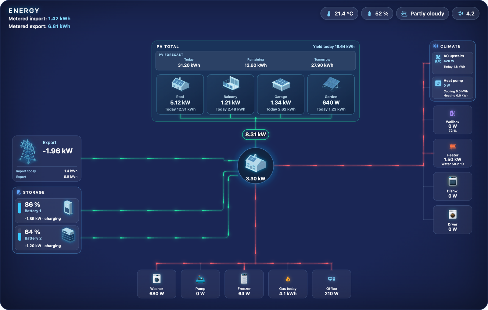
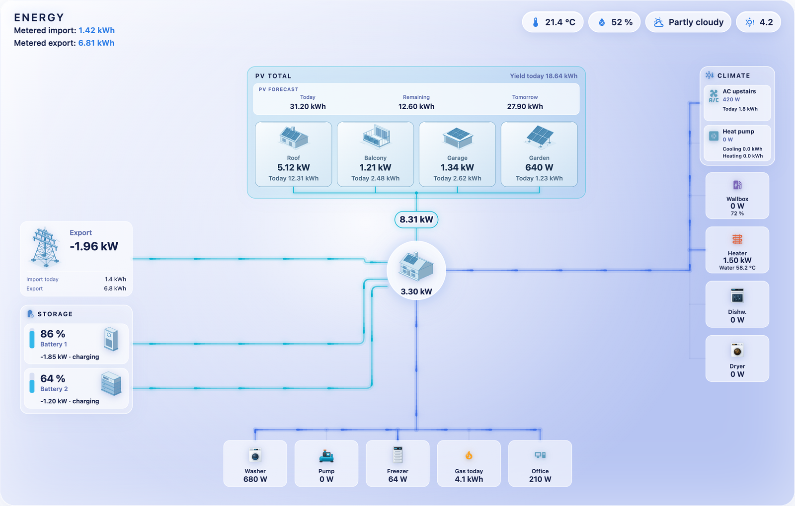
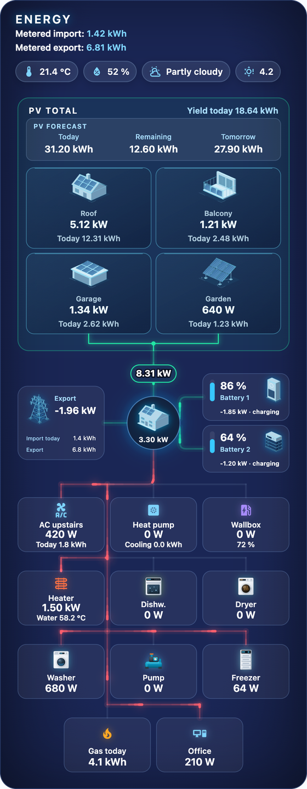
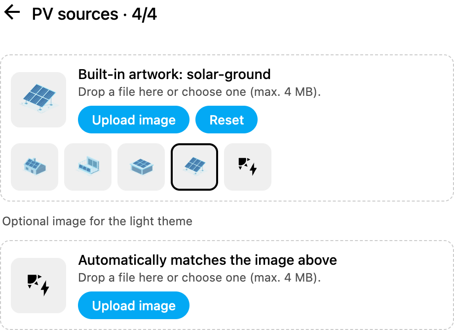
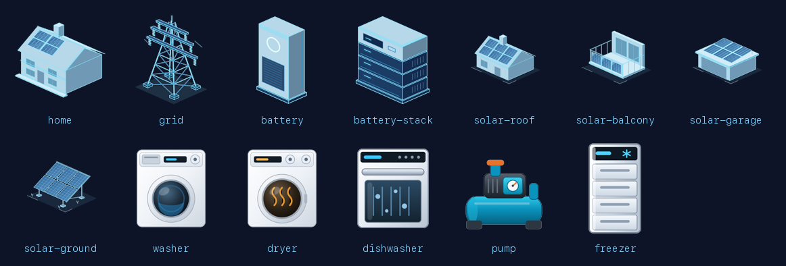
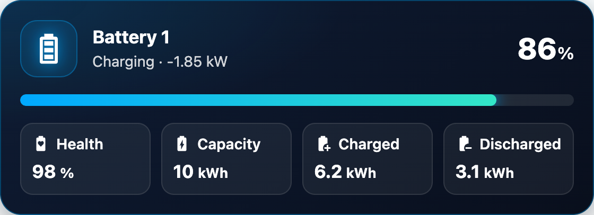

# Glass Energy Flow Card

[Deutsch](README.de.md) · **English**

[](https://hacs.xyz)
[](https://www.home-assistant.io)

Your home's entire energy flow in **one** animated glass-style card: several PV arrays with
daily yield and forecast, storage, grid, house, climate and any number of consumers – with
glowing power flows that show direction and power.



## Features

- **PV total** with any number of arrays (power + yield today) and a **PV forecast**
  (today / remaining / tomorrow)
- **Storage** – several batteries with state of charge and charge/discharge power
- **Grid** with import/export today, **house** with total consumption
- **Climate** – air conditioners/heat pumps with their own metrics (e.g. cooling/heating today)
- **Consumers** – freely configurable, with colour, image and a second line (e.g. the car's
  battery level at the wallbox or the water temperature at the immersion heater)
- **Header** with metered import/export, temperature, humidity, weather and UV index
- **Responsive**: wide, medium and narrow (phone) layouts, chosen automatically
- **9 colour schemes**, light and dark, three wire animations
- **Built-in artwork** for house, grid, storage, PV and appliances – selectable right in the
  editor, plus your own uploads
- **Keeps the screen awake** on Echo Show and Fire tablets – no more photo-frame mode
- **English and German** – the card follows Home Assistant's language automatically
- **Visual editor** – everything by clicking, no YAML needed
- Matching companion: the **Glass Energy Battery Card**

| Light | Phone |
|---|---|
|  |  |

## Installation

### HACS (recommended)

[](https://my.home-assistant.io/redirect/hacs_repository/?owner=bh4it&repository=glass-energy-flow-card&category=plugin)

Or by hand:

1. Open **HACS** in Home Assistant.
2. Top right: **⋮ → Custom repositories**.
3. Repository: `https://github.com/bh4it/glass-energy-flow-card`, type: **Dashboard** → **Add**.
4. Search for **Glass Energy Flow Card** → **Download**.
5. Reload the browser (clear the cache if needed; in the app: *Settings → Companion app →
   Reset frontend cache*).

HACS adds the resource `/hacsfiles/glass-energy-flow-card/glass-energy-flow-card.js`
automatically.

### Manual

1. Copy all files from [`dist/`](dist) to `<config>/www/glass-energy-flow-card/`.
2. **Settings → Dashboards → ⋮ → Resources → Add resource**:
   URL `/local/glass-energy-flow-card/glass-energy-flow-card.js`, type **JavaScript module**.
3. Reload the browser.

## Data sources

The card brings no data of its own – it shows sensors you already have in Home Assistant.
These integrations work well:

| Area | Integration | Note |
|---|---|---|
| Weather | [Open-Meteo](https://www.home-assistant.io/integrations/open_meteo/) | free, no API key; provides the `weather.*` entity |
| UV index | [RESTful sensor](https://www.home-assistant.io/integrations/rest/) against the Open-Meteo API | see the example below |
| PV forecast | [Forecast.Solar](https://www.home-assistant.io/integrations/forecast_solar/) | free: one plane per entry, sum several entries with a template |
| Daily values (yield/import/export today) | [Utility meter](https://www.home-assistant.io/integrations/utility_meter/) helper | *daily* cycle on an energy counter (kWh) |
| Calculated power (house consumption, grid, storage) | [Template](https://www.home-assistant.io/integrations/template/) helper | e.g. house = PV + grid import + discharge − export − charge |
| Energy from power sensors | [Integral](https://www.home-assistant.io/integrations/integration/) helper | when you only have power (W) but need kWh |

**UV index from Open-Meteo** (in `configuration.yaml`, uses your home's location):

```yaml
rest:
  - resource_template: >-
      https://api.open-meteo.com/v1/forecast?latitude={{ state_attr('zone.home', 'latitude') }}&longitude={{ state_attr('zone.home', 'longitude') }}&current=uv_index
    scan_interval: 900
    sensor:
      - name: UV index
        value_template: "{{ value_json.current.uv_index }}"
        state_class: measurement
```

**PV forecast from several Forecast.Solar planes** as a template sensor (Helpers → Template →
Sensor, unit kWh, device class energy):

```jinja
{{ (states('sensor.energy_production_today') | float(0)
  + states('sensor.energy_production_today_2') | float(0)) | round(2) }}
```

The same for `energy_production_today_remaining` (remaining) and `energy_production_tomorrow`
(tomorrow).

PV, storage, grid and consumers work with any integration that reports power in W. As an
example, the card in the [screenshot above](docs/dark-en.png) runs on:
[SolarEdge Modbus Multi](https://github.com/WillCodeForCats/solaredge-modbus-multi) (roof PV),
[Shelly](https://www.home-assistant.io/integrations/shelly/) (balcony PV, grid meter),
[Sonnenbatterie](https://github.com/weltmeyer/ha_sonnenbatterie) and
[Anker Solix](https://github.com/anker-charging/ha-anker-solix-official) (storage),
[my-PV](https://github.com/my-PV/home-assistant-integration) (immersion heater),
[Daikin Onecta](https://github.com/jwillemsen/daikin_onecta) (climate) and
smart plugs via [MQTT](https://www.home-assistant.io/integrations/mqtt/).

## Setup

### 1. Prepare the sensors

The card only shows what you give it. Typically you need:

| For | Sensor | Unit |
|---|---|---|
| PV power per array | current power of the inverter / meter | W |
| PV yield today per array *(optional)* | daily counter, e.g. a *utility meter* helper (daily) | kWh / Wh |
| Grid | grid power: **positive = import, negative = export** | W |
| Storage | state of charge and power: **negative = charging, positive = discharging** | % / W |
| House | total house consumption | W |
| Consumers | power, e.g. from smart plugs | W |

If a sensor has the opposite sign, enable **Invert sign** for grid or storage (`invert: true`).
Where the sensors can come from is described under [Data sources](#data-sources).

### 2. Add the card

1. Open the dashboard → **Edit** → **Add card**.
2. Search for **Glass Energy Flow Card**.
3. Fill in the sections in the editor: PV sources, PV yield & forecast, storage, grid, house,
   climate, consumers, header, colours.

Tip: the card looks best at full width – in a **Sections** view spanning the whole width, or as
a **Panel** view.

### 3. Choose images

House, grid, storage and PV arrays show the built-in artwork without any setting. In the editor
every entry has an image field:



- **Built-in artwork:** click one of the previews. The light theme uses the light variant
  automatically.
- **Icon only:** the icon at the end of the row shows the MDI icon instead of artwork.
- **Your own image:** **Upload image** or drop a file onto the field. A plain background is
  removed automatically while uploading.
- **Reset** restores the default.

In YAML: `image: builtin:<name>`, `image: none` (icon only) or an image URL.



| Name | Used for |
|---|---|
| `home` | house (default) |
| `grid` | grid (default) |
| `battery`, `battery-stack` | storage (default: `battery`) |
| `solar-roof`, `solar-balcony`, `solar-garage`, `solar-ground` | PV arrays (default: `solar-roof`) |
| `washer`, `dryer`, `dishwasher`, `pump`, `freezer` | consumers |

### 4. Keep the screen awake (Echo Show, Fire tablets) *(optional)*

On an Echo Show or a Fire tablet the dashboard gives way to the photo-frame screen after a
while. The card can prevent that: in the editor set **Keep screen awake** to *Echo Show / Fire
tablets only* (YAML: `keep_awake: fire_os`).

- Works while a view containing the card is open – ideal for a dedicated **Panel** view that
  the device shows permanently.
- Tap the screen once after loading; from then on it also survives Alexa timers,
  announcements and calls.
- `keep_awake: always` enables it on every device (e.g. an Android wall tablet).
- To test on a PC: append `?keepawake=force` to the dashboard URL.

### Language

The card and its editor speak German when Home Assistant is set to German, English otherwise.
Numbers are formatted to match (`1.42 kWh` or `1,42 kWh`). Names and labels from your own
configuration are not translated.

## Example configuration

```yaml
type: custom:glass-energy-flow-card
title: Energy
header:
  real_import: sensor.grid_import_today
  real_export: sensor.grid_export_today
  temp: sensor.outdoor_temperature
  humidity: sensor.outdoor_humidity
  weather: weather.home
  uv: sensor.uv_index
pv:
  energy_today: sensor.pv_yield_today
  forecast_today: sensor.pv_forecast_today
  forecast_remaining: sensor.pv_forecast_remaining
  forecast_tomorrow: sensor.pv_forecast_tomorrow
solar:
  - name: Roof
    entity: sensor.pv_roof_power
    energy_today: sensor.pv_roof_yield_today
    image: builtin:solar-roof
  - name: Balcony
    entity: sensor.pv_balcony_power
    energy_today: sensor.pv_balcony_yield_today
    image: builtin:solar-balcony
batteries:
  - name: Battery
    soc: sensor.battery_soc
    power: sensor.battery_power
grid:
  entity: sensor.grid_power
  import_today: sensor.grid_import_today
  export_today: sensor.grid_export_today
home:
  entity: sensor.house_consumption
climate:
  - name: Air conditioning
    entity: sensor.ac_power
    metrics:
      - label: Today
        entity: sensor.ac_energy_today
        unit: kWh
consumers:
  - name: Wallbox
    entity: sensor.wallbox_power
    icon: mdi:ev-station
    color: "#a78bfa"
    secondary:
      entity: sensor.car_battery_level
      unit: "%"
  - name: Washer
    entity: sensor.washer_power
    image: builtin:washer
theme:
  preset: blau
grid_options:
  columns: full
```

## Options

| Section | Options |
|---|---|
| `title` | card heading |
| `keep_awake` | `off` (default), `fire_os` (Echo Show / Fire tablets only), `always` |
| `header` | `real_import`, `real_export` (kWh), `temp`, `humidity`, `weather`, `uv` |
| `pv` | `energy_today`, `forecast_today`, `forecast_remaining`, `forecast_tomorrow` |
| `solar[]` | `name`, `entity` (W), `energy_today`, `icon`, `image`, `image_light` |
| `batteries[]` | `name`, `soc` (%), `power` (W), `invert`, `icon`, `image`, `image_light` |
| `grid` | `entity` (W), `invert`, `import_today`, `export_today`, `name`, `icon`, `image`, `image_light` |
| `home` | `entity` (W), `icon`, `image`, `image_light` |
| `climate[]` | `name`, `entity` (W), `state_entity`, `icon`, `image`, `metrics[]` (`label`, `entity`, `unit`) |
| `consumers[]` | `name`, `entity`, `unit`, `icon`, `color`, `image`, `hidden`, `secondary` (`entity`, `label`, `unit`) |
| `layout` | `mode`: `auto` (default), `wide`, `mid`, `narrow`; breakpoints `wide_min` (1100 px), `mid_min` (680 px) |
| `theme` | `preset`: `blau` (blue), `dunkel` (night blue), `mitternacht` (midnight), `petrol`, `violett` (violet), `grafit` (graphite), `hell` (light), `hell-blau` (light blue), `hell-violett` (light violet); `wires`: `puls` (pulse), `strich` (dashes), `ruhig` (static); fine-tune with `center`, `edge`, `spread`, `tile` |

## Glass Energy Battery Card

A single battery in the same look – with state of charge, power and metrics of your choice.



```yaml
type: custom:glass-energy-battery-card
name: Battery
entity: sensor.battery_soc
power: sensor.battery_power
icon: mdi:battery-high
accent: "#00a8ff"
accent2: "#33e6c7"
details:
  - entity: sensor.battery_health
    name: Health
    icon: mdi:battery-heart-variant
  - entity: sensor.battery_charged_today
    name: Charged
    icon: mdi:battery-plus
```

## Troubleshooting

- **Card not found / "Custom element doesn't exist":** clear the browser cache and reload; check
  that the resource is listed under *Settings → Dashboards → Resources* as a JavaScript module.
- **Flow points the wrong way:** check the sensor's sign and enable **Invert sign** for grid or
  storage.
- **"–" instead of a value:** the sensor is `unknown`/`unavailable` or the entity ID is wrong.
